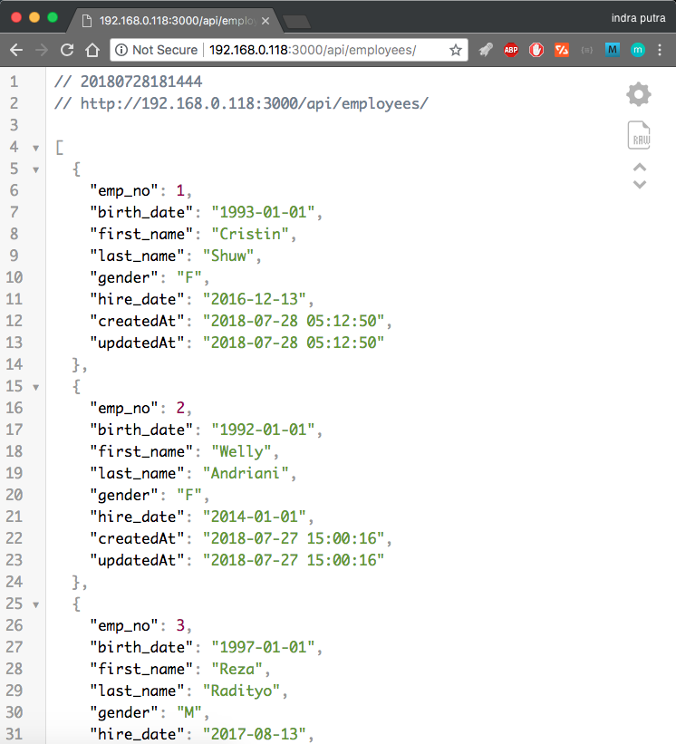

## RPi + mySql + sequelize = REST-API

Dokumentasi penggunaan raspberry pi sebagai local web-server API.

Projek ini saya kerjakan untuk latihan penggunaan API di luar workflow front-end development saya, sehingga tidak banyak menggunakan terminal untuk mengeksekusi nodejs sebagai backend yang mana sudah gantikan dengan raspberry pi.

### A. Setup Raspberry Pi

Silahkan akses RPi dengan metode kalian (GUI / Terminal ssh) kemudian akses terminal dengan mengikuti langkah berikut,

1. Install git

```sudo apt-get install git```

2. Install  mySql

```
apt-get install mysql-server mysql-client
```

lalu buat database berisi tabel dengan skema seperti berikut,

```
mysql> desc employees;
+------------+---------------+------+-----+---------+----------------+
| Field      | Type          | Null | Key | Default | Extra          |
+------------+---------------+------+-----+---------+----------------+
| emp_no     | int(11)       | NO   | PRI | NULL    | auto_increment |
| birth_date | date          | YES  |     | NULL    |                |
| first_name | varchar(14)   | YES  |     | NULL    |                |
| last_name  | varchar(16)   | YES  |     | NULL    |                |
| gender     | enum('M','F') | YES  |     | NULL    |                |
| hire_date  | date          | YES  |     | NULL    |                |
| createdAt  | varchar(20)   | NO   |     | NULL    |                |
| updatedAt  | varchar(20)   | NO   |     | NULL    |                |
+------------+---------------+------+-----+---------+----------------+
8 rows in set (0.00 sec)
```

3. Install NodeJs

```
curl -sL https://deb.nodesource.com/setup_8.x | sudo -E bash -
```

clone repo ini,

```
git clone https://github.com/indraakkk/relational-db.git
```

### B. Akses Server

1. Direktori

pindah kedirektori ```cd relational-db```,

 ```
 npm installl
 ```

2. Aktifkan server

masih didalam direktori ```/relational-db``` jalankan perintah berikut,

```
npm run dev
```

3. Finale

buka browser kemudian ketik alamat ip dari RPi

```192.168.0.118:3000/api/employees```

maka akan tampil database yang sudah kita buat pada awal tahap


